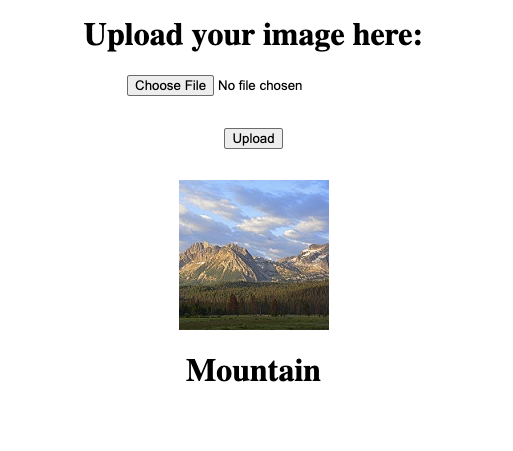

# Image Classification Flask Application
## Description

This is a TensorFlow based Image Classification Neural Network that is hosted on Flask, allowing users to boot up a local web application and upload their own photos and see how well their model performs on training data. The repository contains modules allowing users to unroll a variable amount of data and related classes and train their own neural network on a custom set of data.



## Notable Features

- TensorFlow class implementation of neural network model
- Trained via data generators to allow usage of significantly large datasets (cannot be fit in memory all at once)
- Flask Web App interface for users to upload their own photos and get an image classification prediction based on the labels the model was trained on
- Transfer learning using pre-trained MobileNetV2 model. Two models are provided
    - `transfer_model.h5`, model trained by attaching last layer corresponding to the classes and freezing all layers of the pre-trained model
    - `transfer_model_tune.h5`, model trained by freezing the first 100 layers (60%) and training the unfrozen layers

## Requirements & Versioning

The Flask web application and TensorFlow model was developed on Python 3.7 and the following package versions:

    Flask == 1.1.1
    tensorflow == 2.2.0
    Keras == 2.4.3
    numpy == 1.18.1
    pandas == 1.0.1

## Quick Start
### Installing Dependencies

I have provided a pretrained model within the model folder that is pretrained on 14,000 images using the [Intel Image Classification Kaggle dataset](https://www.kaggle.com/puneet6060/intel-image-classification)

1. Install Python 3

2. Install relevant packages:
  ```
  pip install
  ```
  
3. `cd` to the directory containing `app.py` (This is the core file that runs the Flask web app)

4. Add PATH to environment variable using `export FLASK_APP=app.py`

5. Start up the Flask local server using `flask run`

6. Go to the local server URL (Defaults to [http://127.0.0.1:5000/](http://127.0.0.1:5000/))

### Training Your Model

I also provided packages so that users can unpack their own datasets and train their own models.

1. Copy data set into the top-level directory of the file

2. Run the command `python process_data.py --unroll ./path/to/data`

3. Run the command to train the model `python train_model.py`

After training, the model will be saved to the model folder, overwriting any existing model or related image classification labels pre-saved there. IMPORTANT: The Flask `app.py` file points to the model folder to load the saved model and related labels - if you change the name of directory structure, the Flask app will not work.

## How It Works

**Directory Structure:**

```
image-class
|
+-- data (Where processed data is moved to)
|   +-- data_labels.csv
|   +-- images
|       +-- [all images]
|
+-- img
|   +-- (Screenshot for markdown example)
|
+-- model
|   +-- label.txt
|   +-- model.h5
|   +-- transfer_model.h5
|   +-- transfer_model_tune.h5
|
+-- package
|   +-- 
|
+-- raw (This is where I kept my data - you do not have to do the same)
|
+-- static
|   +-- upload_image.css
|   +-- upload_image.scss
|   +-- images (Images uploaded to Python Flask app saved here)
|
+-- templates
|   +-- upload_image.html
|
+-- requirements.txt
+-- README.md
+-- app.py
+-- process_data.py
+-- train_model.py
```

### The Neural Network Model

The model framework resides in the `nn_model.py` file. The model is built on the TensorFlow/Keras API and is simple, containing no more than 15 hidden layers. The methods of the class mirror the methods inherent to TensorFlow Sequential type models.

### Data Generator

The data generator file `data_generator.py` is used to generate data in mini-batches for training. This allows for users to train their data on very large datasets that cannot be held in memory at one single time (16+ GB or however much memory your computer has). The generator by default looks for processed data within the data folder and shuffles the training set after every epoch.

### Train Model

The `train_model.py` file is an executable that imports the .csv file containing all image names and their related labels. The module automatically splits the dataset into training and validation generators and feeds them into the neural network model. Parameters `gparams` is defined in the file and defines what dimensions the input image array should be in, what size of each batch should be, and the number of classes identified by the dataset. Currently, the neural network model is programmed to take input dimensions of `(28, 28, 3)` so this parameter cannot be changed or else it will throw an error.
